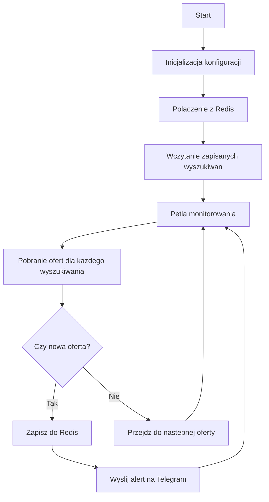

# Monitor Ofert Pracy - Pracuj.pl Scraper

Monitor ofert pracy z portalu pracuj.pl z powiadomieniami na Telegram. Narzedzie automatycznie skanuje nowe oferty pracy i wysyla powiadomienia gdy pojawi sie nowa oferta zgodna z kryteriami wyszukiwania.

## Schemat dzialania



## Wymagania
- Python 3.8+
- Redis
- Telegram Bot Token
- Docker (opcjonalnie)

## Instalacja

1. Sklonuj repozytorium:
```bash
git clone <repository-url>
cd pracuj-monitor
```

2. Stworz wirtualne srodowisko:
```bash
python -m venv venv
source venv/bin/activate  # Linux/Mac
venv\Scripts\activate     # Windows
```

3. Zainstaluj wymagane pakiety:
```bash
pip install -r requirements.txt
```

4. Uruchom Redis:
```bash
# Usando Docker
docker-compose up -d
```

5. Konfiguracja Telegram bota:
- Utworz bota poprzez BotFather na Telegramie (@BotFather)
- Skopiuj otrzymany token
- Znajdz swoje Chat ID wysylajac wiadomosc do @userinfobot

6. Ustaw zmienne srodowiskowe:
```bash
# Linux/Mac
export REDIS_URL="redis://localhost:6379"
export TELEGRAM_TOKEN="your-token"
export TELEGRAM_CHAT_ID="your-chat-id"

# Windows
set REDIS_URL=redis://localhost:6379
set TELEGRAM_TOKEN=your-token
set TELEGRAM_CHAT_ID=your-chat-id
```

## Uzycie

1. Uruchom skrypt:
```bash
python monitor.py
```

2. Dodawanie nowego wyszukiwania:
```python
monitor = JobMonitor()
monitor.add_search("Python Developer", "Warszawa")
monitor.add_search("DevOps Engineer")  # wszystkie lokalizacje
monitor.run()
```

## Konfiguracja

Mozesz dostosowac nastepujace parametry w `DEFAULT_CONFIG`:
- `CHECK_INTERVAL`: Czestotliwosc sprawdzania nowych ofert (w sekundach)
- `DEFAULT_SEARCHES`: Domyslne wyszukiwania
- Parametry polaczenia z Redis

## Funkcjonalnosci

- Monitorowanie wielu wyszukiwan jednoczesnie
- Zapisywanie stanu w Redis (unikanie duplikatow powiadomien)
- Powiadomienia Telegram z szczegolami oferty
- Obsluga bledow i automatyczne wznawianie
- Elastyczna konfiguracja przez zmienne srodowiskowe

## Struktura powiadomien

Kazde powiadomienie zawiera:
- Tytul stanowiska
- Nazwe firmy
- Lokalizacje
- Poziom stanowiska
- Wymagane technologie
- Wynagrodzenie (jesli podano)
- Link do oferty
- Date publikacji

## Bezpieczenstwo

- Unikaj przechowywania tokenu Telegram w kodzie
- Uzyj zmiennych srodowiskowych dla wrazliwych danych
- Ogranicz czestotliwosc zapytan aby uniknac blokady

## Rozwiazywanie problemow

1. Problem z Redis:
- Sprawdz czy Redis jest uruchomiony
- Zweryfikuj URL polaczenia
- Sprawdz logi Redis

2. Problem z Telegramem:
- Zweryfikuj token i chat ID
- Sprawdz czy bot ma uprawnienia do wysylania wiadomosci

3. Bledy scrapowania:
- Sprawdz logi
- Zweryfikuj format URL
- Sprawdz czy struktura strony sie nie zmienila